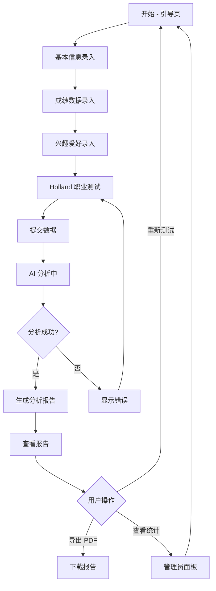
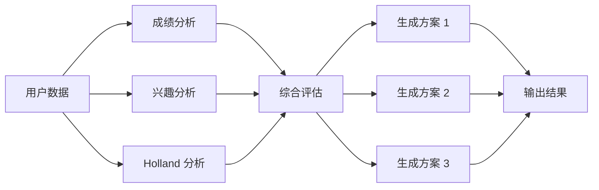

# 智能选科系统 - 项目详细文档

## 📋 目录

- [系统概述](#系统概述)
- [业务背景](#业务背景)
- [系统架构](#系统架构)
- [业务流程](#业务流程)
- [功能模块详解](#功能模块详解)
- [技术实现](#技术实现)
- [数据模型](#数据模型)
- [AI 分析逻辑](#ai-分析逻辑)

---

## 系统概述

### 项目定位

智能选科系统（The Tree - Smart Subject Selection）是一个面向**高中生**的科学选科决策支持平台。在新高考改革背景下，学生需要从物理、化学、生物、历史、地理、政治等科目中选择 3 门作为高考科目，这个决策将直接影响未来的专业选择和职业发展。

### 核心目标

- **科学决策**：基于多维度数据（成绩、兴趣、职业倾向）提供科学的选科建议
- **个性化推荐**：利用 AI 技术为每个学生生成个性化的选科方案
- **职业规划**：将选科决策与未来专业、职业发展路径相结合
- **可视化呈现**：通过图表和报告直观展示分析结果

### 系统特点

1. **多维度评估**：整合成绩数据、兴趣爱好、职业倾向测试
2. **AI 驱动**：利用 Google Gemini AI 进行深度分析
3. **科学测评**：采用国际通用的 Holland 职业兴趣测试（RIASEC 模型）
4. **用户友好**：流畅的分步引导流程，精美的可视化报告

---

## 业务背景

### 新高考改革

中国新高考改革实行"3+3"或"3+1+2"模式：
- **3**：语文、数学、英语（必考）
- **3**：从物理、化学、生物、历史、地理、政治中选择 3 门
- 或 **1+2**：从物理/历史中选 1 门，从剩余 4 门中选 2 门

### 选科困境

学生在选科时面临的主要问题：
1. **信息不对称**：不了解各科目对应的专业和职业方向
2. **决策盲目**：仅凭兴趣或成绩单一维度做决策
3. **缺乏指导**：学校和家长难以提供专业的职业规划建议
4. **后果严重**：选科失误可能导致专业受限、职业发展受阻

### 解决方案

本系统通过以下方式解决上述问题：
- **数据整合**：综合考虑成绩、兴趣、职业倾向
- **AI 分析**：利用大语言模型进行深度分析和推理
- **科学测评**：引入 Holland 职业兴趣测试
- **可视化报告**：生成详细的分析报告和职业路径图

---

## 系统架构

### 技术架构

```
┌─────────────────────────────────────────────────────────┐
│                     用户界面层 (UI)                      │
│         React 19 + TypeScript + Tailwind CSS            │
└─────────────────────────────────────────────────────────┘
                            │
                            ↓
┌─────────────────────────────────────────────────────────┐
│                    组件层 (Components)                   │
│  StepIntro │ StepGrades │ StepInterests │ StepHolland  │
│              LoadingAnalysis │ Report                   │
└─────────────────────────────────────────────────────────┘
                            │
                            ↓
┌─────────────────────────────────────────────────────────┐
│                   业务逻辑层 (Services)                  │
│              geminiService.ts (AI 接口)                 │
└─────────────────────────────────────────────────────────┘
                            │
                            ↓
┌─────────────────────────────────────────────────────────┐
│                   外部服务 (External)                    │
│              Google Gemini AI API                       │
└─────────────────────────────────────────────────────────┘
```

### 应用架构

```
App.tsx (主控制器)
├── 状态管理
│   ├── step: 当前步骤
│   ├── userData: 用户数据
│   └── aiResult: AI 分析结果
├── 流程控制
│   ├── handleNext(): 下一步
│   ├── handleBack(): 返回
│   ├── handleFinalSubmit(): 提交分析
│   └── handleRestart(): 重新开始
└── 组件渲染
    └── renderStep(): 根据步骤渲染对应组件
```

---

## 业务流程

### 主流程图



### 详细流程说明

#### 1. 引导页 (StepIntro)
- **输入**：姓名、性别
- **验证**：姓名不能为空
- **输出**：基本用户信息
- **特殊功能**：隐藏的管理员入口（点击标题 5 次）

#### 2. 成绩录入 (StepGrades)
- **输入**：
  - 考试名称（如"高一期中考试"）
  - 各科成绩（语文、数学、英语、物理、化学、生物、历史、地理、政治）
  - 总分、排名、总人数
  - 选考科目等级（A/B/C/D/E）
- **功能**：
  - 支持添加多次考试记录
  - 自动计算总分
  - 成绩趋势可视化
  - 编辑/删除已有记录
- **验证**：至少录入一次考试成绩

#### 3. 兴趣录入 (StepInterests)
- **输入**：
  - 感兴趣的学科（多选）
  - 感兴趣的专业方向（文本）
  - 感兴趣的职业领域（文本）
  - 特殊才能和优势（文本）
- **验证**：至少选择一个感兴趣的学科

#### 4. Holland 测试 (StepHolland)
- **测试内容**：60 道题目，每题对应 RIASEC 六个维度之一
  - **R (Realistic)**：实际型 - 喜欢动手操作
  - **I (Investigative)**：研究型 - 喜欢探索研究
  - **A (Artistic)**：艺术型 - 喜欢创作表达
  - **S (Social)**：社会型 - 喜欢帮助他人
  - **E (Enterprising)**：企业型 - 喜欢领导管理
  - **C (Conventional)**：常规型 - 喜欢规范秩序
- **评分**：每题 1 分，统计各维度得分
- **结果**：生成 Holland 代码（如"IRS"表示研究型-实际型-社会型）

#### 5. AI 分析 (LoadingAnalysis)
- **数据准备**：整合所有用户数据
- **API 调用**：发送到 Gemini AI
- **分析维度**：
  - 成绩优势分析
  - 兴趣匹配度
  - 职业倾向适配
  - 专业方向建议
- **生成结果**：3 套选科方案（高、中、低匹配度）

#### 6. 报告展示 (Report)
- **学生概况**：AI 生成的综合评价
- **选科方案**：
  - 方案 1（最推荐）：匹配度 85-100
  - 方案 2（备选）：匹配度 70-84
  - 方案 3（可考虑）：匹配度 60-69
- **每个方案包含**：
  - 推荐科目组合
  - 匹配度评分
  - 推荐理由
  - 对应专业（高概率 + 中概率）
  - 职业路径（高相关 + 潜在方向）
- **可视化**：
  - 成绩趋势折线图
  - Holland 测试雷达图
  - 方案对比表
- **操作**：
  - 导出 PDF
  - 重新测试

#### 7. 管理员面板 (AdminDashboard)
- **统计数据**：
  - 总用户数
  - 各科目选择频率
  - Holland 类型分布
  - 性别分布
- **可视化**：
  - 科目选择柱状图
  - Holland 类型饼图
  - 趋势分析

---

## 功能模块详解

### 1. 数据采集模块

#### 1.1 基本信息
```typescript
interface BasicInfo {
  name: string;        // 姓名
  gender: Gender;      // 性别 (Boy/Girl)
}
```

#### 1.2 成绩数据
```typescript
interface ExamRecord {
  examName: string;                    // 考试名称
  scores: Record<string, number>;      // 各科成绩
  subjectGrades?: Record<string, string>; // 等级 (A/B/C/D/E)
  totalScore?: number;                 // 总分
  rank?: number;                       // 排名
  totalStudents?: number;              // 总人数
}
```

**功能特点**：
- 支持 9 门科目的成绩录入
- 自动计算总分
- 支持等级制评分（选考科目）
- 多次考试记录管理
- 成绩趋势可视化

#### 1.3 兴趣数据
```typescript
interface InterestData {
  interestedSubjects: string[];    // 感兴趣的学科
  interestedMajors?: string;       // 感兴趣的专业
  interestedCareers?: string;      // 感兴趣的职业
  specialTalents: string;          // 特殊才能
}
```

#### 1.4 Holland 测试数据
```typescript
interface HollandData {
  hollandScores: Record<string, number>; // RIASEC 各维度得分
  hollandCode: string;                   // Holland 代码 (如 "IRS")
}
```

### 2. AI 分析模块

#### 2.1 输入数据结构
```typescript
interface UserProfile {
  name: string;
  gender: Gender;
  exams: ExamRecord[];
  interestedSubjects: string[];
  interestedMajors?: string;
  interestedCareers?: string;
  specialTalents: string;
  hollandScores: Record<string, number>;
  hollandCode: string;
}
```

#### 2.2 输出数据结构
```typescript
interface AIAnalysisResult {
  studentSummary: string;           // 学生综合评价
  recommendations: Recommendation[]; // 3 套推荐方案
}

interface Recommendation {
  subjects: string[];    // 推荐科目组合
  score: number;         // 匹配度评分 (0-100)
  reason: string;        // 推荐理由
  path: CareerPath;      // 职业路径
}

interface CareerPath {
  majors: {
    highProb: string[];   // 高概率专业
    medProb: string[];    // 中概率专业
  };
  careers: {
    highRel: string[];    // 高相关职业
    potential: string[];  // 潜在职业
  };
}
```

#### 2.3 分析逻辑

AI 分析基于以下维度：

1. **成绩优势分析**
   - 计算各科平均分和排名
   - 识别优势科目和弱势科目
   - 分析成绩趋势（上升/稳定/下降）

2. **兴趣匹配度**
   - 对比感兴趣的学科与成绩表现
   - 评估兴趣与能力的一致性
   - 考虑专业和职业意向

3. **职业倾向适配**
   - 根据 Holland 代码匹配适合的科目
   - 例如：
     - I (研究型) → 物理、化学、生物
     - A (艺术型) → 历史、地理
     - E (企业型) → 政治、历史

4. **综合权重**
   - 成绩：40%
   - 兴趣：30%
   - 职业倾向：30%

### 3. 报告生成模块

#### 3.1 报告结构

```
┌─────────────────────────────────────┐
│          学生基本信息                │
│  姓名 | 性别 | Holland 代码          │
└─────────────────────────────────────┘
┌─────────────────────────────────────┐
│          学生综合评价                │
│  AI 生成的个性化评价文本             │
└─────────────────────────────────────┘
┌─────────────────────────────────────┐
│          成绩趋势分析                │
│  折线图：各科成绩变化趋势            │
└─────────────────────────────────────┘
┌─────────────────────────────────────┐
│        Holland 测试结果              │
│  雷达图：RIASEC 六维度得分           │
└─────────────────────────────────────┘
┌─────────────────────────────────────┐
│          选科方案推荐                │
│  方案 1 (最推荐) - 匹配度 XX%        │
│  方案 2 (备选)   - 匹配度 XX%        │
│  方案 3 (可考虑) - 匹配度 XX%        │
└─────────────────────────────────────┘
┌─────────────────────────────────────┐
│          职业发展路径                │
│  专业方向 | 职业选择                 │
└─────────────────────────────────────┘
```

#### 3.2 可视化组件

1. **成绩趋势图**（Recharts LineChart）
   - X 轴：考试次数
   - Y 轴：分数
   - 多条折线：各科目成绩变化

2. **Holland 雷达图**（Recharts RadarChart）
   - 6 个维度：R、I、A、S、E、C
   - 显示各维度得分

3. **方案对比表**
   - 科目组合
   - 匹配度评分
   - 推荐理由
   - 专业和职业路径

#### 3.3 PDF 导出

使用浏览器原生 `window.print()` 功能：
- 隐藏不必要的 UI 元素
- 优化打印样式
- 保留图表和表格

### 4. 管理员统计模块

#### 4.1 统计维度

1. **用户统计**
   - 总用户数
   - 性别分布

2. **科目统计**
   - 各科目被选择的次数
   - 科目组合频率
   - 热门组合 TOP 5

3. **Holland 类型统计**
   - 各类型人数分布
   - 类型组合分析

4. **趋势分析**
   - 时间维度的使用趋势
   - 选科偏好变化

#### 4.2 数据存储

使用 `localStorage` 存储：
```typescript
// 存储结构
{
  "selection_records": [
    {
      "timestamp": "2024-12-25T10:30:00Z",
      "name": "张三",
      "gender": "Boy",
      "subjects": ["Physics", "Chemistry", "Biology"],
      "hollandCode": "IRS",
      "score": 85
    },
    // ...
  ]
}
```

---

## 技术实现

### 1. 前端技术栈

#### 1.1 核心框架
- **React 19.2**：最新版本，支持并发特性
- **TypeScript 5.8**：类型安全，提升开发体验
- **Vite 6.2**：快速的构建工具

#### 1.2 UI 实现
- **Tailwind CSS**：通过内联样式实现
- **响应式设计**：适配桌面和移动端
- **动画效果**：CSS 过渡和动画

#### 1.3 图表库
- **Recharts 3.6**：基于 React 的图表库
  - LineChart：成绩趋势
  - RadarChart：Holland 测试结果
  - BarChart：统计数据

### 2. 状态管理

使用 React Hooks 进行状态管理：

```typescript
// 主状态
const [step, setStep] = useState<Step>(Step.INTRO);
const [userData, setUserData] = useState<Partial<UserProfile>>({});
const [aiResult, setAiResult] = useState<AIAnalysisResult | null>(null);

// 状态更新
const updateUserData = (data: Partial<UserProfile>) => {
  setUserData(prev => ({ ...prev, ...data }));
};
```

### 3. AI 服务集成

#### 3.1 Gemini API 调用

```typescript
// services/geminiService.ts
export async function generateSelectionAdvice(
  profile: UserProfile
): Promise<AIAnalysisResult> {
  const apiKey = import.meta.env.VITE_GEMINI_API_KEY;

  // 构建 prompt
  const prompt = buildPrompt(profile);

  // 调用 API
  const response = await fetch(
    `https://generativelanguage.googleapis.com/v1beta/models/gemini-pro:generateContent?key=${apiKey}`,
    {
      method: 'POST',
      headers: { 'Content-Type': 'application/json' },
      body: JSON.stringify({
        contents: [{ parts: [{ text: prompt }] }]
      })
    }
  );

  // 解析结果
  const result = await response.json();
  return parseAIResponse(result);
}
```

#### 3.2 Prompt 工程

Prompt 结构：
```
你是一位资深的高中生涯规划专家...

学生信息：
- 姓名：{name}
- 性别：{gender}
- Holland 代码：{hollandCode}

成绩数据：
{exams}

兴趣爱好：
{interests}

请提供 3 套选科方案，格式如下：
{JSON 格式说明}
```

### 4. 数据持久化

#### 4.1 LocalStorage

```typescript
// 保存记录
const saveRecord = (record: SelectionRecord) => {
  const records = JSON.parse(
    localStorage.getItem('selection_records') || '[]'
  );
  records.push(record);
  localStorage.setItem('selection_records', JSON.stringify(records));
};

// 读取记录
const getRecords = (): SelectionRecord[] => {
  return JSON.parse(
    localStorage.getItem('selection_records') || '[]'
  );
};
```

#### 4.2 数据导出

```typescript
// 导出为 JSON
const exportData = () => {
  const data = {
    userData,
    aiResult,
    timestamp: new Date().toISOString()
  };
  const blob = new Blob([JSON.stringify(data, null, 2)], {
    type: 'application/json'
  });
  const url = URL.createObjectURL(blob);
  // 触发下载
};
```

### 5. 性能优化

#### 5.1 代码分割
- 使用 React.lazy 和 Suspense
- 按路由分割代码

#### 5.2 图表优化
- 数据采样（大数据集）
- 防抖和节流

#### 5.3 缓存策略
- API 响应缓存
- 图片懒加载

---

## 数据模型

### 完整类型定义

```typescript
// 枚举类型
export enum Gender {
  MALE = 'Boy',
  FEMALE = 'Girl'
}

export enum Subject {
  CHINESE = 'Chinese',
  MATH = 'Math',
  ENGLISH = 'English',
  PHYSICS = 'Physics',
  CHEMISTRY = 'Chemistry',
  BIOLOGY = 'Biology',
  HISTORY = 'History',
  GEOGRAPHY = 'Geography',
  POLITICS = 'Politics'
}

// 考试记录
export interface ExamRecord {
  examName: string;
  scores: Record<string, number>;
  subjectGrades?: Record<string, string>;
  totalScore?: number;
  rank?: number;
  totalStudents?: number;
}

// Holland 测试题目
export interface HollandQuestion {
  id: number;
  text: string;
  type: string; // R, I, A, S, E, C
}

// 用户档案
export interface UserProfile {
  name: string;
  gender: Gender;
  exams: ExamRecord[];
  interestedSubjects: string[];
  interestedMajors?: string;
  interestedCareers?: string;
  specialTalents: string;
  hollandScores: Record<string, number>;
  hollandCode: string;
}

// 职业路径
export interface CareerPath {
  majors: {
    highProb: string[];
    medProb: string[];
  };
  careers: {
    highRel: string[];
    potential: string[];
  };
}

// 推荐方案
export interface Recommendation {
  subjects: string[];
  score: number;
  reason: string;
  path: CareerPath;
}

// AI 分析结果
export interface AIAnalysisResult {
  studentSummary: string;
  recommendations: Recommendation[];
}
```

---

## AI 分析逻辑

### Prompt 设计原则

1. **角色定位**：资深生涯规划专家
2. **任务明确**：生成 3 套选科方案
3. **格式规范**：JSON 格式输出
4. **考虑全面**：成绩、兴趣、职业倾向

### 分析流程



### 评分算法

```typescript
// 伪代码
function calculateScore(
  subjects: string[],
  profile: UserProfile
): number {
  let score = 0;

  // 成绩维度 (40%)
  const gradeScore = calculateGradeScore(subjects, profile.exams);
  score += gradeScore * 0.4;

  // 兴趣维度 (30%)
  const interestScore = calculateInterestScore(
    subjects,
    profile.interestedSubjects
  );
  score += interestScore * 0.3;

  // Holland 维度 (30%)
  const hollandScore = calculateHollandScore(
    subjects,
    profile.hollandCode
  );
  score += hollandScore * 0.3;

  return Math.round(score);
}
```

---

## 总结

智能选科系统通过整合**成绩数据**、**兴趣爱好**和**职业倾向测试**，利用 **AI 技术**为高中生提供科学的选科决策支持。系统采用现代化的技术栈，提供流畅的用户体验和精美的可视化报告，帮助学生做出更明智的选科决策，为未来的专业选择和职业发展奠定基础。

### 核心优势

1. ✅ **科学性**：基于多维度数据和 AI 分析
2. ✅ **个性化**：为每个学生生成定制化方案
3. ✅ **可视化**：直观的图表和报告
4. ✅ **易用性**：流畅的分步引导流程
5. ✅ **可扩展**：模块化设计，易于扩展新功能

### 未来展望

- 📈 **数据分析**：积累数据后进行大数据分析
- 🎓 **专业库**：建立完整的专业-职业数据库
- 🤝 **社交功能**：学生交流和经验分享
- 📱 **移动应用**：开发原生移动应用
- 🔗 **学校集成**：与学校教务系统对接

---

**文档版本**：v1.0
**最后更新**：2024-12-25
**维护者**：开发团队
